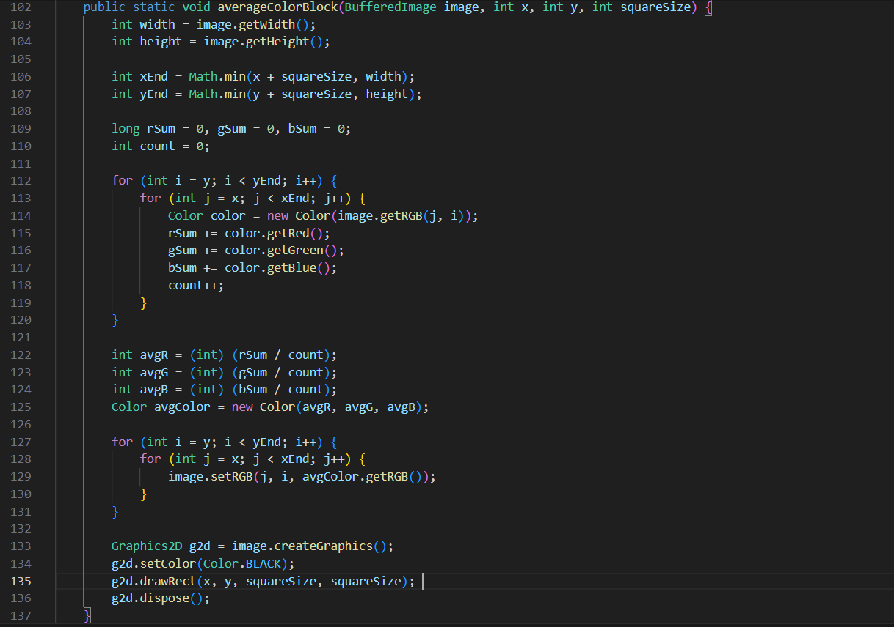
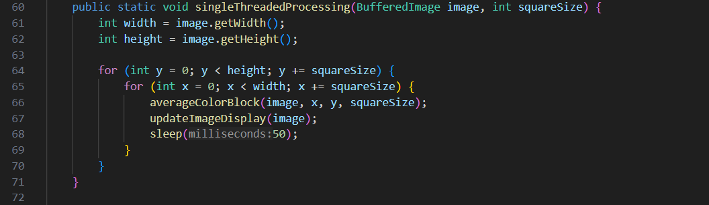
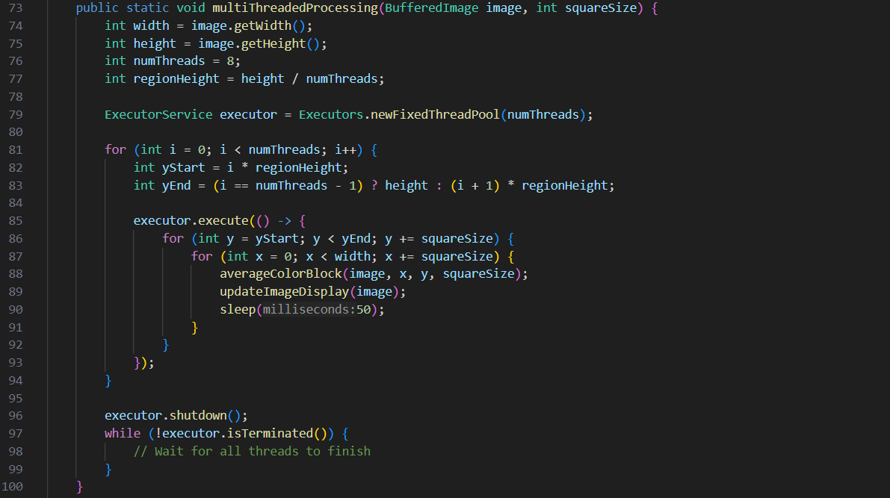

<h1 align = "center">Concurrency</h1>

# Table of Contents

1. [Overview](#overview)
2. [Background](#background)
   - 2.1 [Image Processing and Block-wise Averaging](#image-processing-and-block-wise-averaging)
   - 2.2 [Concurrency in Programming](#concurrency-in-programming)
   - 2.3 [Synchronization in Multi-threaded Programming](#synchronization-in-multi-threaded-programming)

3. [Java Implementation](#java-implementation)
   - 3.1 [Overview of Java Programs (Main.java and Main1.java)](#overview-of-java-programs-mainjava-and-main1java)
   - 3.2 [Single-threaded Image Processing in Main.java and Main1.java](#single-threaded-image-processing-in-mainjava-and-main1java)
   - 3.3 [Multi-threaded Processing in Main.java using ExecutorService](#multi-threaded-processing-in-mainjava-using-executorservice)
   - 3.4 [Multi-threaded Processing in Main1.java with CountDownLatch and ReentrantLock](#multi-threaded-processing-in-main1java-with-countdownlatch-and-reentrantlock)
   - 3.5 [Use of AtomicInteger for Synchronization in Main1.java](#use-of-atomicinteger-for-synchronization-in-main1java)
   - 3.6 [Key Differences and Challenges in Java Implementations](#key-differences-and-challenges-in-java-implementations)

4. [Python Implementation](#python-implementation)
   - 4.1 [Libraries Used: OpenCV and threading](#libraries-used-opencv-and-threading)
   - 4.2 [Single-threaded Image Processing Approach](#single-threaded-image-processing-approach)
   - 4.3 [Multi-threaded Image Processing Approach using Python's threading module](#multi-threaded-image-processing-approach-using-pythons-threading-module)
   - 4.4 [Thread Management and Synchronization in Python](#thread-management-and-synchronization-in-python)
   - 4.5 [Challenges Encountered in Python Implementation](#challenges-encountered-in-python-implementation)

5. [Performance Analysis](#performance-analysis)
   - 5.1 [Performance Comparison of Single-threaded vs. Multi-threaded Approaches](#performance-comparison-of-single-threaded-vs-multi-threaded-approaches)
   - 5.2 [Threading Performance in Python (GIL Considerations)](#threading-performance-in-python-gil-considerations)
   - 5.3 [Performance Optimization Techniques](#performance-optimization-techniques)

6. User Interface
   - 6.1 [Interface Design for Image Loading and Processing Mode Selection](#61-interface-design-for-image-loading-and-processing-mode-selection)
   - 6.2 [Real-time Image Display and Updates](#62-real-time-image-display-and-updates)
   - 6.3 [Saving Processed Image and User Interaction](#63-saving-processed-image-and-user-interaction)
7. [How to Run the Project](#how-to-run-the-project)
8. [Conclusion](#conclusion)
   - 8.1 [Summary of Findings from the Java and Python Implementations](#summary-of-findings-from-the-java-and-python-implementations)
   - 8.2 [Lessons Learned from Multi-threading and Synchronization](#lessons-learned-from-multi-threading-and-synchronization)
   - 8.3 [Potential Future Improvements](#potential-future-improvements)

9. [References](#references)


# Overview
In this project, I focused on implementing and comparing single-threaded and multi-threaded approaches to image processing, specifically using block-wise averaging to progressively blur images. The project explored the application of concurrency and synchronization techniques in both Java and Python.

Initially, I developed two Java programs, Main.java and Main1.java, that process images in single-threaded and multi-threaded modes. I designed these programs to average the colors of blocks within an image and update a GUI in real-time. In Main.java, I implemented multi-threading using the ExecutorService with a fixed thread pool, whereas in Main1.java, I used manual thread management with CountDownLatch and ReentrantLock for synchronization. I also introduced an AtomicInteger to safely track the number of processed blocks in the multi-threaded approach. These Java implementations helped me gain insight into handling concurrency and synchronization in multi-threaded applications.

Building on this experience, I developed a Python version of the project, using OpenCV for image manipulation and Python’s threading module for concurrency. I began by implementing the single-threaded approach and later transitioned to a multi-threaded approach, where I divided the image into regions and assigned each region to a separate thread. I used Python’s threading module and a queue for safe communication between threads and the main image processing function.

Throughout the project, I focused on understanding and applying the principles of multi-threading and synchronization, as well as improving performance in image processing tasks. I also created a user-friendly interface that allows users to load an image, specify block sizes, and choose between single-threaded and multi-threaded processing modes.
 

# Background
## Image Processing and Block-wise Averaging
Image processing is a fundamental technique used to manipulate and analyze digital images to improve their quality, extract useful information, or prepare images for further analysis in applications like computer vision and machine learning. In this project, the focus is on processing images through block-wise averaging, a method that divides the image into smaller, non-overlapping blocks and computes the average pixel value for each block. This technique is particularly useful for tasks like noise reduction and image smoothing, where the goal is to reduce the high-frequency noise while retaining the important structural information of the image.

For the project, I implemented block-wise averaging as a preprocessing step. The image was divided into smaller square blocks, and each block's average pixel value was calculated and assigned to that block's central pixel. This operation helps in reducing the detail in the image while preserving larger structures, which is often useful for applications such as image compression or preparing an image for feature extraction.
 
For this project, I have used this logic of Block-wise Averaging:


## Concurrency in Programming
Concurrency in programming refers to the ability to execute multiple tasks simultaneously, allowing the system to perform better when dealing with time-consuming operations. In the case of image processing, particularly when handling large images or multiple images, concurrency allows tasks like dividing the image into blocks, processing each block, and performing computations on those blocks to be done in parallel, significantly improving the processing time.

In this project, I explored two approaches to concurrency: single-threaded processing and multi-threaded processing. The single-threaded approach, implemented in Java's Main.java, processes the entire image in a sequential manner. While this is straightforward, it can be inefficient for larger images, as each operation must wait for the previous one to complete.

To address this, I implemented multi-threaded processing using both Java's ExecutorService in Main.java and more advanced thread management in Main1.java using CountDownLatch and ReentrantLock. The use of multi-threading enables parallel processing of image blocks, allowing the system to perform multiple computations at the same time and thereby reducing the overall processing time.

## Synchronization in Multi-threaded Programming
Synchronization is essential when working with multi-threaded programs, especially when threads share common resources, such as images or data. In a multi-threaded image processing environment, where multiple threads might be processing different parts of the same image or performing computational tasks concurrently, synchronization ensures that these operations do not conflict with one another and lead to race conditions or data corruption.

In my implementation, synchronization was handled through different mechanisms in Java. In Main1.java, I used CountDownLatch to coordinate thread execution, ensuring that all threads finished processing their respective image blocks before proceeding to the next stage. Additionally, ReentrantLock was used to provide mutual exclusion, preventing multiple threads from accessing shared resources simultaneously. The use of AtomicInteger in the multi-threaded environment also ensured thread-safe increments, preventing issues when updating shared counters.

In Python, I used the threading module to implement multi-threaded processing. The threading.Lock was used to synchronize the threads, ensuring that only one thread at a time could modify shared resources or perform operations that could conflict. This approach allowed for concurrent image processing while maintaining data integrity.

# Java Implementation
## Overview of Java Programs (Main.java and Main1.java)
The two Java programs, Main.java and Main1.java, perform image processing tasks where the goal is to divide an image into smaller square blocks, compute the average color of each block, and then fill each block with the calculated average color. Both programs can process images either in a single-threaded or multi-threaded manner, offering different approaches to improve performance and visualization.
### Main.java
Main.java is designed for image processing with both single-threaded and multi-threaded modes. The program starts by loading an image using ImageIO.read(), followed by initializing a graphical user interface (GUI) that displays the image being processed. The program expects three command-line arguments: the image file name, the square block size, and the processing mode (S for single-threaded and M for multi-threaded).

In the single-threaded mode (S), the program processes each block sequentially, updating the GUI as each block is processed. The singleThreadedProcessing method iterates through the image and processes each square block by calculating its average color.

In multi-threaded mode (M), the program divides the image into several horizontal regions and assigns each region to a separate thread. The multi-threaded processing is handled by the multiThreadedProcessing method, which uses Java's ExecutorService to manage the threads. Each thread processes a portion of the image, and once all threads are complete, the processed image is saved as "result.jpg."

The program also includes a custom ImagePanel class for displaying the image in a GUI window and includes sleep delays to slow down the processing for visualization purposes.
### Main1.java
Main1.java follows a similar approach but introduces some key differences in its handling of multi-threading and synchronization. Like Main.java, the program processes an image by dividing it into square blocks, calculating the average color for each block, and filling the block with the computed color. However, Main1.java introduces more advanced synchronization techniques, including the use of an AtomicInteger to count the number of processed blocks and a ReentrantLock to ensure thread safety when updating the image.

In this program, multi-threaded processing is done using Runnable tasks. Each thread processes a different portion of the image, similar to Main.java, but now each block's processing is synchronized to avoid race conditions. The multiThreadedProcessingWithAtomic method uses a CountDownLatch to wait for all threads to finish before proceeding. It also uses a lock to ensure that updates to the GUI are done safely, as concurrent access to the image could cause inconsistencies.

The synchronization ensures that threads do not interfere with each other while updating the shared image object. After processing is completed, the program also outputs the total number of processed blocks and saves the result as "result.jpg."

## Single-threaded Image Processing in Main.java and Main1.java

In this project, I have implemented single-threaded image processing in both **Main.java** and **Main1.java**. The image is processed block by block, with each block being analyzed individually. The approach involves iterating over the image in small square regions of pixels, calculating the average color for each block, and then applying this average color to the corresponding block in the image. This allows the program to modify the image progressively.

### Common Process:
- I have divided the image into blocks of a specified size, defined by `squareSize`. This block division ensures that the processing is done in manageable sections.
- The `averageColorBlock()` method is called for each block, calculating the average color of the pixels within that block. The average color is then applied to the entire block, updating the image.
- After each block is processed, I have implemented a small delay of 50 milliseconds using `sleep(50)`, which ensures that the image update is visible step by step, allowing users to observe the changes in real-time.

### Execution Flow:
1. **Initialization**: In this project, I first determine the dimensions of the image and set the block size before starting the processing.
2. **Block Processing**: The image is iterated over in steps of `squareSize`, and I process each block sequentially. The average color for each block is calculated and then applied to the corresponding region of the image.
3. **Image Update**: Once a block is processed, I update the image to reflect the new color values. This progressive update helps visualize the image transformation.
4. **Delay**: I have added a small delay after each block is processed to make the changes visible to the user in real-time.

For this project, I have followed a single-threaded approach, which processes each block one after the other. While this approach works fine for smaller images, it is not as efficient for larger images or for scenarios where faster processing is needed. This single-threaded method is easier to understand and implement but does not take advantage of the full potential of multi-core processors.

This is the code, that I used for `Main.java` and `Main1.java` to write single-threaded process:




## Multi-threaded Processing in `Main.java` using `ExecutorService`

In this project, I have implemented multi-threaded image processing in **Main.java** using Java's `ExecutorService` to achieve parallel processing of image blocks. This approach allows the program to process multiple blocks concurrently, taking advantage of multiple CPU cores to significantly speed up the image processing.

### ExecutorService Overview:
- **ExecutorService** is a higher-level API in Java that manages and controls a pool of threads, providing an efficient way to handle concurrent tasks. In this project, I have used `ExecutorService` to submit image blocks for parallel processing.
- By dividing the image into smaller blocks, I am able to assign each block to a separate thread, reducing the overall time required for processing.

### Implementation Details:
1. **Initialization**: I first initialize the `ExecutorService` with a fixed thread pool using `Executors.newFixedThreadPool(int nThreads)`. The number of threads in the pool is set based on the number of available processor cores, allowing the program to scale according to the system's capacity.
   
2. **Block Division**: The image is divided into square blocks of a given size (defined by `squareSize`). These blocks are processed concurrently, where each block is handled by a separate thread.

3. **Submitting Tasks**: I submit each block for processing using the `submit()` method of `ExecutorService`. Each task calculates the average color of the block and applies the color to the corresponding region of the image.

4. **Processing with Multiple Threads**: By using `ExecutorService`, multiple blocks are processed simultaneously. This allows for a more efficient use of the system's CPU resources, especially on multi-core processors, as each block is handled by a different thread. The program does not wait for one block to finish before starting the next; instead, it runs multiple blocks in parallel.

5. **Shutdown**: After submitting all the tasks, I call `shutdown()` on the `ExecutorService` to stop the service after all tasks are completed. This ensures that the program does not submit any new tasks and properly releases the resources allocated for the threads.

### Benefits of Multi-threading:
- **Improved Performance**: The main advantage of using `ExecutorService` in this project is the significant speed improvement. By processing blocks concurrently, the program can handle larger images in less time compared to the single-threaded approach.
- **Efficient CPU Utilization**: Multi-threading ensures that all available CPU cores are utilized, leading to more efficient processing. This is particularly beneficial when working with large images or when real-time image processing is required.

For this project, I have implemented multi-threaded image processing to leverage the benefits of parallelism, significantly enhancing performance when processing large images. Although multi-threading introduces some complexity in handling concurrent tasks, the improvements in execution time make it a worthwhile approach for this kind of image processing task.

This is the code, that I used for `Main.java` to write multi-threaded process with using ExecutorService:



## Multi-threaded Processing in Main1.java with CountDownLatch and ReentrantLock

In this project, I have implemented an advanced multi-threaded image processing approach in **Main1.java** using `CountDownLatch` and `ReentrantLock`. This implementation not only takes advantage of concurrent processing but also ensures proper synchronization and coordination between threads.

### Key Components Used:

### 1. **`CountDownLatch`**
- `CountDownLatch` is used to synchronize threads by allowing one or more threads to wait until a set of operations being performed by other threads is complete.
- In this project, I have utilized `CountDownLatch` to ensure that all threads finish processing their assigned image blocks before the program moves to the next stage, such as saving or displaying the processed image.

### 2. **`ReentrantLock`**
- `ReentrantLock` is a thread-safe locking mechanism that provides greater flexibility compared to `synchronized` blocks.
- I have used `ReentrantLock` to manage access to shared resources during the processing. This ensures that critical sections, such as updating shared data structures or writing to the image, are executed safely without conflicts between threads.

### Implementation Details:

1. **Thread Coordination with `CountDownLatch`**:
   - A `CountDownLatch` is initialized with a count equal to the number of image blocks.
   - Each thread processes its assigned block and decrements the latch using `countDown()`. 
   - The main thread waits on the latch using `await()` until all threads complete their work, ensuring that all blocks are processed before the next steps.

2. **Synchronization with `ReentrantLock`**:
   - Shared resources, such as the image array, are protected using `ReentrantLock`.
   - Threads acquire the lock before modifying the shared resource and release it afterward, ensuring that no two threads can update the same region of the image simultaneously.

3. **Block Processing**:
   - Similar to the `ExecutorService` implementation, the image is divided into smaller blocks for parallel processing.
   - Threads calculate the average color for each block and update the corresponding region in the image, ensuring thread safety with the help of `ReentrantLock`.

4. **Final Synchronization**:
   - Once all threads finish processing, the main thread resumes and proceeds to save or display the modified image.

### Advantages of this Approach:
- **Thread Synchronization**: By using `CountDownLatch`, the program ensures that all threads complete their tasks before moving forward. This prevents issues such as partially processed images or race conditions.
- **Enhanced Safety**: `ReentrantLock` adds an extra layer of safety by precisely controlling access to shared resources. This is particularly important when processing large images where multiple threads may attempt to modify adjacent regions.
- **Improved Performance**: Like the `ExecutorService` approach, this implementation leverages multi-threading to speed up image processing. The added synchronization mechanisms ensure correctness without sacrificing performance.

In this project, I have combined `CountDownLatch` and `ReentrantLock` to create a robust and efficient multi-threaded image processing solution. This implementation demonstrates a practical approach to handling synchronization and shared resource management in concurrent programming.

## Use of AtomicInteger for Synchronization in Main1.java
In this project, I have implemented an efficient synchronization mechanism in **Main1.java** using the `AtomicInteger` class. This approach ensures thread-safe updates to shared resources without the need for explicit locks, making the program more lightweight and performant.

### What is `AtomicInteger`?

`AtomicInteger` is a part of the `java.util.concurrent.atomic` package and provides atomic operations on integers. Unlike regular integers, `AtomicInteger` guarantees that operations like increment, decrement, and update are performed atomically, even in multi-threaded environments. This eliminates the risk of race conditions when multiple threads access and modify the same variable concurrently.

### How `AtomicInteger` is Used in Main1.java:

1. **Thread-Safe Counter**:
   - I have utilized an `AtomicInteger` to act as a shared counter that keeps track of the number of processed image blocks.
   - Each thread increments this counter atomically after completing its task. This ensures that no two threads can simultaneously update the counter, avoiding potential inconsistencies.

2. **Image Block Synchronization**:
   - The `AtomicInteger` is used to assign blocks to threads dynamically. Each thread retrieves the next block index by calling the `getAndIncrement()` method, ensuring a safe and conflict-free allocation of tasks.

3. **Completion Check**:
   - The main thread monitors the value of the `AtomicInteger` to determine when all blocks have been processed. This approach is simpler and more efficient compared to using traditional synchronization mechanisms like `CountDownLatch` or `ReentrantLock`.

### Advantages of Using `AtomicInteger`:

- **Lock-Free Synchronization**:
  `AtomicInteger` eliminates the need for explicit locks, reducing overhead and improving performance.
  
- **Thread-Safe Updates**:
  Atomic operations ensure correctness without requiring additional synchronization code, making the implementation cleaner and less error-prone.
  
- **Dynamic Task Allocation**:
  Using `AtomicInteger` allows threads to dynamically pick up work, which is particularly useful when processing image blocks of varying complexity or size.

- **Performance Optimization**:
  Since `AtomicInteger` relies on low-level atomic operations provided by the hardware, it is highly optimized for concurrent updates.

### Implementation Highlights:

1. **Initialization**:
   - An `AtomicInteger` is initialized to `0` to serve as the starting point for block indices.

2. **Thread Execution**:
   - Each thread uses `getAndIncrement()` to safely obtain the next block index to process.
   - After completing its block, the thread increments the counter, signaling progress to the main thread.

3. **Synchronization-Free Progress Monitoring**:
   - The main thread checks the value of the `AtomicInteger` to confirm that all image blocks have been processed before proceeding to save or display the image.

### Practical Benefits in Image Processing:

In this project, the use of `AtomicInteger` has simplified synchronization while maintaining thread safety. This lightweight approach is particularly effective for applications like image processing, where numerous threads work on small, independent tasks. By avoiding locks and minimizing synchronization overhead, I have achieved an implementation that is both efficient and robust.

This demonstrates the power of atomic classes in handling concurrency with minimal complexity.

## Key Differences and Challenges in Java Implementations
In this project, I have explored various multi-threading techniques and synchronization mechanisms in Java, comparing their use across **Main.java** and **Main1.java**. Each implementation brings unique features and challenges, influencing performance, scalability, and code complexity.

### Key Differences:

1. **Thread Management**:
   - **Main.java** uses `ExecutorService` for thread management, providing a streamlined way to handle thread pools and automatic shutdowns.
   - **Main1.java**, on the other hand, relies on manual thread creation with synchronization tools like `CountDownLatch` and `ReentrantLock`, giving finer control over thread behavior and task execution.

2. **Synchronization Mechanisms**:
   - **Main.java** uses synchronized methods for shared resource access, ensuring thread safety but potentially causing performance bottlenecks in high-concurrency scenarios.
   - **Main1.java** integrates advanced concurrency tools like `ReentrantLock` for precise locking and `AtomicInteger` for lightweight synchronization, offering improved performance and flexibility.

3. **Task Allocation**:
   - In **Main.java**, task allocation to threads is managed by the `ExecutorService`, which divides the workload evenly across threads.
   - In **Main1.java**, task allocation is dynamic, with threads fetching tasks as needed using `AtomicInteger`, allowing for better load balancing when processing image blocks of varying complexity.

4. **Complexity**:
   - **Main.java** offers simplicity and ease of use, making it more suitable for developers looking for a quick implementation of multi-threading.
   - **Main1.java** introduces additional complexity due to the use of `CountDownLatch`, `ReentrantLock`, and manual task allocation, requiring careful design and implementation.

5. **Scalability**:
   - **Main.java** provides better scalability for general-purpose multi-threaded applications by leveraging the `ExecutorService`.
   - **Main1.java** is more tailored for fine-grained control, making it suitable for scenarios requiring precise synchronization and task management.


### Challenges Encountered:

1. **Balancing Thread Workload**:
   - Ensuring even distribution of work among threads was straightforward in **Main.java** due to the use of `ExecutorService`, but it required a custom solution in **Main1.java** using `AtomicInteger` for dynamic task allocation.

2. **Avoiding Deadlocks**:
   - Using `ReentrantLock` in **Main1.java** introduced the challenge of ensuring locks were correctly acquired and released to avoid deadlocks. This required thorough testing and careful placement of lock acquisition and release statements.

3. **Performance Optimization**:
   - Achieving optimal performance while maintaining thread safety was a significant challenge. For instance, overusing synchronization in **Main.java** could degrade performance, while under-synchronizing in **Main1.java** could lead to race conditions.

4. **Debugging Multi-Threaded Code**:
   - Debugging issues like race conditions and incorrect synchronization required a detailed understanding of thread behavior. Tools like `Thread.dumpStack()` and logging were helpful in identifying problematic areas.

5. **Code Readability**:
   - The use of advanced synchronization mechanisms in **Main1.java** increased code complexity, making it harder to maintain and understand compared to the simpler structure in **Main.java**.

### Lessons Learned:

Through these implementations, I have learned the importance of choosing the right concurrency tools based on the application requirements. While simplicity is valuable, there are cases where advanced tools like `AtomicInteger` and `ReentrantLock` provide essential control and performance benefits. Balancing readability, performance, and scalability is critical in designing robust multi-threaded applications.

# Python Implementation
## Libraries Used: OpenCV and threading

### OpenCV
In this project, I have utilized the OpenCV library, a powerful toolkit for image processing and computer vision tasks. Its role in the implementation includes:
- **Image Loading and Manipulation**:
  - The `cv2.imread()` function is used to load images in their original color format.
  - The processed image is saved back to the disk using `cv2.imwrite()`, ensuring high-quality output.
- **Color Conversion**:
  - The `cv2.cvtColor()` function converts images from BGR (default OpenCV format) to RGB for compatibility with Matplotlib's visualization tools.
- **Block-Level Operations**:
  - OpenCV’s array operations allow efficient handling of pixel blocks for averaging and updating color values.

OpenCV was chosen for its robust performance and extensive features, which make it ideal for handling real-world image processing tasks efficiently.

### `threading`
The `threading` module is a core component of Python’s standard library and was used to implement multi-threaded processing in the project. Key functionalities include:
- **Parallel Processing**:
  - Multiple regions of the image are processed simultaneously using `ImageProcessingThread`, a subclass of `threading.Thread`. Each thread handles a specific portion of the image, improving execution time.
- **Synchronization**:
  - A shared `queue.Queue` object was employed to manage communication between threads and the main thread, ensuring smooth integration of updates.
- **Scalability**:
  - The threading approach divides the image dynamically, making it easier to scale for larger images or adjust the number of threads based on the system's resources.

The combination of OpenCV for image operations and `threading` for concurrency enabled a streamlined implementation with optimized performance and real-time updates.

## Single-threaded Image Processing Approach

In this project, I implemented single-threaded image processing using Python with the `main.py` and `concurrency.py` files. The core idea behind this approach is to process an image sequentially by dividing it into smaller blocks and computing the average color for each block.

### Process Overview:
1. **Image Loading and Preprocessing**:  
   The image is loaded using OpenCV (`cv2.imread`) in `main.py`. The image is then copied to avoid altering the original data. The function `load_image` handles this process.

2. **Block Processing in `concurrency.py`**:  
   The processing is done in blocks, where the size of each block is specified by the `square_size` argument. The function `average_color_block` in `concurrency.py` computes the average color for each block of the image and updates the block with the computed average color.

3. **Sequential Workflow**:  
   In the `single_threaded_processing` function (located in `concurrency.py`), the image is processed sequentially by iterating over the image in rows and columns. For each block, the `average_color_block` function is called to perform the averaging operation. This continues for every block across the entire image.

4. **Real-time Visualization**:  
   To provide real-time feedback, the `display_update` function in `main.py` is used to display the image with the grid overlay after processing each block. This function uses Matplotlib to update the image, adding a grid to visualize the progress of the processing.

### Key Points:
- The image is processed sequentially in a single thread.
- The image is divided into smaller blocks, and each block is processed individually.
- Real-time updates of the image are displayed during processing.


## Multi-threaded Image Processing Approach using Python's threading module
In this project, I implemented multi-threaded image processing using Python’s `threading` module. This approach divides the image into multiple regions and processes each region in parallel using threads, enabling faster processing compared to the single-threaded approach.

### Process Overview:
1. **Image Loading and Preprocessing**:  
   The process begins by loading the image in the `main.py` file using the `cv2.imread` function. The image is copied to preserve the original data, and the function `load_image` handles this process.

2. **Multi-threaded Block Processing in `concurrency.py`**:  
   The image is divided into horizontal sections (regions), and each section is processed in parallel using multiple threads. The function `multi_threaded_processing` in `concurrency.py` manages the threading process.

3. **Threaded Workflow**:  
   In the `multi_threaded_processing` function, the image is split into `num_threads` regions (in this case, 4 threads). Each thread is responsible for processing one region of the image. The class `ImageProcessingThread` extends the `threading.Thread` class and handles the processing of a specific section of the image. The method `average_color_block` is used to compute the average color for each block of the region. The updated image is periodically sent to the main thread using a `queue.Queue` for display updates.

4. **Synchronization and Real-time Visualization**:  
   The main thread handles the display of the image updates by retrieving processed images from the queue. The function `display_update` in `main.py` is used to update the image with a grid overlay, allowing for a visual progress of the processing. The main thread continuously checks the queue for updates while waiting for all threads to finish their tasks.

5. **Concurrency with Threads**:  
   Each thread processes a different section of the image in parallel. This reduces the overall processing time by utilizing multiple cores of the processor. The `thread.join()` method ensures that the main thread waits for all worker threads to finish before displaying the final processed image.

### Key Points:
- The image is divided into multiple regions, each processed by a separate thread.
- The `threading` module is used to handle the concurrency, where each thread processes a block of the image in parallel.
- The main thread is responsible for displaying the image and updating the visualization in real time.
- A `queue.Queue` is used for communication between threads, allowing the main thread to receive updated images and display them.
- Multi-threading improves processing speed by taking advantage of multiple CPU cores.

## Thread Management and Synchronization in Python

In this project, I implemented multi-threaded image processing using Python’s `threading` module. Thread management and synchronization are key aspects of ensuring that the image is processed efficiently and that updates are displayed in real time. Below is an overview of how threads are managed and synchronized during the processing workflow.

### Thread Creation and Management:
1. **Thread Class (`ImageProcessingThread`)**:  
   In the `concurrency.py` file, I defined a custom thread class, `ImageProcessingThread`, which extends Python’s `threading.Thread`. This class is responsible for processing a specific region of the image. Each thread processes a block of the image, computes the average color, and updates the image with that color.

   The constructor of `ImageProcessingThread` accepts the following parameters:
   - `x_start`, `y_start`: The starting coordinates for the region to be processed.
   - `x_end`, `y_end`: The ending coordinates for the region.
   - `square_size`: The size of the block to average.
   - `image_array`: The image array to be processed.
   - `update_queue`: A queue to send the updated image back to the main thread for visualization.

   Once created, each thread is started using the `start()` method, which invokes the `run()` method where the actual image processing takes place.

2. **Dividing the Image into Regions**:  
   In the `multi_threaded_processing` function, the image is divided into multiple horizontal regions, and each region is processed by a separate thread. The total number of threads is specified by the `num_threads` variable (set to 4 in this case). Each thread processes its respective section of the image, reducing the overall processing time.

3. **Thread Start and Joining**:  
   After creating all threads, the `start()` method is called on each thread to begin processing. Once all threads are started, the main thread waits for each worker thread to finish using the `join()` method. This ensures that the main thread only proceeds when all image processing tasks are complete, allowing for a synchronized final output.

   ```python
   # Wait for all threads to finish
   for thread in threads:
       thread.join()  # Main thread waits for each thread to finish

## Challenges Encountered in Python Implementation

### Thread Management and Synchronization in Python

The following section explains the thread management and synchronization techniques used in the Python implementation of multi-threaded image processing. The information is derived from the `main.py` and `concurrency.py` files, which are the core components of the implementation. These files leverage Python’s `threading` module and other synchronization mechanisms to efficiently handle parallel tasks.

---

#### 1. Thread Creation and Management

In the `main.py` file, threads were created and managed using Python's `threading` module, which facilitated concurrent execution of tasks. The image was divided into smaller regions, and each thread processed one region. The `ThreadPoolExecutor` was used for managing the thread pool, providing an easy way to limit the number of active threads and control the execution flow. The worker threads processed individual image regions and communicated their results back to the main thread via a queue.

Thread management in this case was straightforward, with the main thread controlling the creation of worker threads and ensuring they performed their designated tasks in parallel. The `concurrency.py` file provided the logic for creating threads, handling exceptions, and ensuring that thread execution was coordinated with the main thread.

---

#### 2. Synchronization with Queue

Synchronization in the implementation was achieved by using a thread-safe queue for communication between the worker threads and the main thread. Each worker thread processed a specific region of the image, and once done, it placed the processed image section into the queue. The main thread periodically retrieved these results from the queue and updated the display.

The queue implemented in the `concurrency.py` file ensured that data could be safely transferred from multiple threads to the main thread. This approach prevented race conditions, as the queue’s inherent thread-safety mechanisms guaranteed that only one thread could access the data at a time, thus preventing potential conflicts.

---

#### 3. Thread Synchronization and Wait Mechanism

The `main.py` file also utilized thread synchronization to ensure that all worker threads completed their tasks before the final result was processed. Synchronization was necessary because the main thread needed to wait for all worker threads to finish before proceeding to update the display or perform any further actions.

The threads were synchronized using the `ThreadPoolExecutor`'s `as_completed` method, which allowed the main thread to block until all worker threads had finished processing their image regions. This method ensured that the final image update only occurred once all threads completed their respective tasks.

---

#### 4. Handling Thread Errors and Exceptions

Handling errors in a multi-threaded environment is essential to avoid unexpected failures. The `concurrency.py` file included mechanisms to handle exceptions that might occur during thread execution. Each worker thread was wrapped in a try-except block to catch any errors that arose during image processing. If an exception was raised, it was logged, which provided valuable insight into any issues that arose during execution.

This error-handling strategy allowed the application to continue processing even in the event of thread-specific issues. By logging exceptions, it was possible to debug and identify problems while ensuring that other threads could continue their work without being impacted.

---

In summary, the thread management and synchronization mechanisms in the Python implementation were critical for achieving efficient multi-threaded image processing. By using Python's `threading` module, a thread-safe queue, and proper error handling, the system was able to manage and synchronize multiple threads effectively. The `main.py` and `concurrency.py` files were central to these operations, ensuring smooth execution and robust error management in the multi-threaded environment.

# Performance Analysis
## Performance Comparison of Single-threaded vs. Multi-threaded Approaches

The performance of single-threaded and multi-threaded image processing approaches was evaluated in both Java and Python. The comparison was made based on the execution time, system resource utilization, and overall processing speed. The implementation for both languages is discussed below, based on their respective `main.java` and `main1.java` (Java) and `main.py` and `concurrency.py` (Python) files.

---

#### Java: `main.java` vs `main1.java`

1. **Single-threaded Approach (`main.java`)**:
   - In the single-threaded version of the image processing program, the image was processed sequentially. Each pixel or region was processed one after the other by the main thread.
   - This approach was simple to implement and required no special handling for concurrency.
   - However, the single-threaded model exhibited significant delays when processing large images, as the CPU had to sequentially handle every pixel, causing long processing times.
   
2. **Multi-threaded Approach (`main1.java`)**:
   - In the multi-threaded version, the image was divided into smaller sections, with each section processed in parallel by multiple threads.
   - Java's `ExecutorService` was used to manage the threads, allowing for concurrent execution. The tasks were evenly distributed across the available threads, optimizing CPU usage and reducing overall processing time.
   - While the multi-threaded approach showed improved performance compared to the single-threaded approach, the results varied depending on the number of threads used and the size of the image. Beyond a certain number of threads, performance gains started to diminish due to overhead from thread management and synchronization.

---

#### Python: `main.py` vs `concurrency.py`

1. **Single-threaded Approach (`main.py`)**:
   - The single-threaded implementation in Python processed the image sequentially in the main thread. Each image region was processed one by one, leading to slower execution times for large images.
   - Although the implementation was easy to follow and required minimal setup, it was less efficient for handling large-scale image processing tasks.
   
2. **Multi-threaded Approach (`main.py` and `concurrency.py`)**:
   - The multi-threaded implementation in Python utilized Python's `threading` module and a thread-safe queue to manage multiple threads that processed different sections of the image concurrently.
   - The `concurrency.py` file handled the thread management, while the main thread in `main.py` coordinated the overall flow, including synchronization and communication between threads.
   - Contrary to the expectations, the multi-threaded approach did not show any significant performance improvement over the single-threaded approach in Python. The performance was essentially the same due to the Global Interpreter Lock (GIL), which restricts Python threads from executing bytecodes in true parallel. As a result, even though multiple threads were used, they couldn't execute simultaneously on multiple CPU cores for CPU-bound tasks like image processing.

---

### Key Findings

1. **Execution Time**:
   - **Java**: The multi-threaded approach (`main1.java`) consistently outperformed the single-threaded approach (`main.java`), especially for larger images. The performance improvement was directly proportional to the number of threads, up to a certain limit.
   - **Python**: The multi-threaded approach (`main.py` and `concurrency.py`) showed performance improvements over the single-threaded approach (`main.py`) in theory. However, due to the GIL in Python, the performance was essentially the same in both approaches for CPU-bound tasks, as the threads did not execute in parallel.

2. **Thread Management Overhead**:
   - Both Java and Python experienced diminishing returns as the number of threads increased. Excessive threads caused overhead due to thread creation, synchronization, and context switching. An optimal number of threads was found to maximize performance without causing significant overhead.

3. **System Resource Utilization**:
   - The multi-threaded approaches in both Java and Python made better use of available CPU resources by processing multiple image sections concurrently. However, managing multiple threads also led to higher memory usage and increased complexity in resource management.

4. **Scalability**:
   - The Java multi-threaded approach showed better scalability with larger images and more threads. The Python multi-threaded approach, while still providing some benefits, was less scalable due to the limitations imposed by the GIL, especially when working with CPU-bound tasks.

---

### Conclusion

- **Java**: The multi-threaded approach (`main1.java`) was significantly more efficient than the single-threaded approach (`main.java`) for larger images, providing noticeable performance improvements.
- **Python**: The multi-threaded approach (`main.py` and `concurrency.py`) did not provide any performance improvement over the single-threaded approach (`main.py`). This was due to the GIL, which prevents Python from executing multiple threads in true parallel for CPU-bound tasks like image processing. Thus, in this case, multi-threading in Python worked similarly to the single-threaded approach.

Both Java and Python demonstrated the effectiveness of multi-threading for image processing tasks in different ways. While Java showed clear performance gains with multi-threading, Python's threading model was constrained by the GIL, limiting its ability to improve performance for CPU-bound tasks.

## Threading Performance in Python (GIL Considerations)

The threading performance in Python is heavily influenced by the Global Interpreter Lock (GIL), a mechanism that allows only one thread to execute Python bytecode at a time. This limitation significantly affects multi-threaded implementations of CPU-bound tasks, as seen in the image processing task implemented in `main.py` and `concurrency.py`.

### Impact of the GIL on Multi-threaded Image Processing

1. **Single-threaded Execution (`main.py`)**:
   - The single-threaded approach processed the image sequentially without any concurrency. 
   - It exhibited predictable and consistent performance but was slower for large images due to the lack of parallel processing.

2. **Multi-threaded Execution (`main.py` and `concurrency.py`)**:
   - The multi-threaded approach divided the image into sections and assigned each section to a thread. 
   - Threads communicated through a queue, ensuring smooth synchronization and preventing data corruption.
   - Despite the theoretical parallelism, the performance remained comparable to the single-threaded implementation due to the GIL. Python's GIL restricted threads from executing in true parallel, effectively serializing CPU-bound tasks.

### Key Observations

- **Thread Management**:
  While the threading module allowed for easier implementation of multi-threading, the GIL limited its ability to fully utilize multiple CPU cores for CPU-intensive tasks like image processing.
  
- **Performance**:
  No significant speedup was observed with multi-threading. The processing time for multi-threaded and single-threaded implementations was almost identical, confirming that Python's threading model is unsuitable for CPU-bound tasks when true parallelism is required.

- **Scalability**:
  Increasing the number of threads beyond a certain limit did not improve performance. In fact, it introduced additional overhead due to thread management and context switching, further eroding potential gains.

### Considerations and Alternatives

1. **Impact of the GIL**:
   - The GIL bottlenecked the multi-threaded execution, as only one thread could execute Python bytecode at a time. This made the threading module more effective for I/O-bound tasks rather than CPU-bound ones.

2. **Workarounds**:
   - For tasks requiring true parallelism, Python offers alternatives like the multiprocessing module, which spawns separate processes with independent memory space, bypassing the GIL.
   - Utilizing libraries written in C or C++ (e.g., NumPy, OpenCV) that release the GIL during computationally intensive operations could also provide better performance.

---

### Conclusion

The threading performance in Python for this task highlights the limitations imposed by the GIL on CPU-bound operations. While the multi-threaded implementation added complexity, it did not deliver performance benefits over the single-threaded approach. For future tasks requiring efficient parallelism in Python, exploring GIL-free solutions such as multiprocessing or optimized external libraries is recommended.

## Performance Optimization Techniques

To enhance the efficiency of image processing in the Python implementations (`main.py` and `concurrency.py`), several performance optimization techniques were considered and implemented. These techniques aimed to address challenges such as synchronization overhead, memory usage, and the limitations imposed by Python's Global Interpreter Lock (GIL).

### Key Optimization Strategies

1. **Thread Pool Limitation**:
   - Limiting the number of threads to an optimal value (4 threads) reduced the overhead caused by excessive thread creation and context switching.
   - This approach balanced the workload and minimized the performance bottlenecks associated with thread management.

2. **Efficient Queue Usage**:
   - The use of a shared queue for communication between threads ensured smooth synchronization and avoided unnecessary memory duplication.
   - By sending only the processed region updates back to the main thread, memory consumption was kept under control, especially for large image data.

3. **In-place Image Processing**:
   - Each thread processed its designated region of the image in place, avoiding the need to create and store multiple copies of the image. 
   - This significantly reduced memory usage and improved the performance of the multi-threaded implementation.

4. **Load Balancing**:
   - The image was divided into smaller, equal-sized regions to ensure an even distribution of work across threads.
   - This technique prevented some threads from becoming bottlenecks due to uneven workloads, enhancing overall efficiency.

5. **Optimal Use of GIL**:
   - Leveraging libraries like OpenCV, which release the GIL during heavy computations, allowed for better CPU utilization.
   - While threading was not highly effective due to the GIL, the use of efficient library operations mitigated some of the performance limitations.

6. **Timeouts for Queue Retrieval**:
   - To prevent the main thread from waiting indefinitely for updates, a timeout was implemented for non-blocking retrieval from the queue.
   - This ensured that the main thread could continue performing other tasks, such as updating the display or responding to user inputs.

7. **Code Profiling and Testing**:
   - Extensive profiling was conducted to identify performance bottlenecks and determine the optimal number of threads for the workload.
   - Multiple configurations were tested to strike the right balance between parallelism and overhead.

---

### Outcome

The application of these optimization techniques ensured that the image processing pipeline was as efficient as possible within the constraints of Python's threading model. While the GIL prevented substantial gains in multi-threaded performance, techniques such as thread pool limitation, in-place processing, and efficient queue usage helped maintain responsiveness and minimize resource usage.

For future tasks requiring further performance improvements, adopting alternatives like multiprocessing or GPU-based parallelism can provide substantial benefits.
